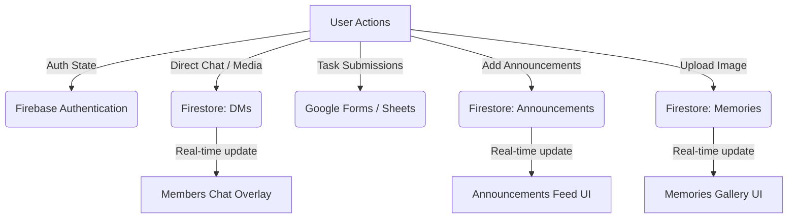

# DNMX Clan Headquarters — Walkthrough

This document outlines the design structure, technical architecture, and functionality of the DNMX Clan Headquarters web application.

---

## 1. Directory Structure

The website is divided into modular, structured files to facilitate maintainability and performance:
- [index.html](file:///home/manav/Personal/Dnmx/index.html): The Home page containing the Hero section, core statistics, principles, and the "Why Join" feature set.
- [hierachy.html](file:///home/manav/Personal/Dnmx/hierachy.html): Contains the rank directory and filters.
- [rules.html](file:///home/manav/Personal/Dnmx/rules.html): Contains the code of conduct and rules.
- [council.html](file:///home/manav/Personal/Dnmx/council.html): Contains Executive and Management Council member profiles.
- [tasks.html](file:///home/manav/Personal/Dnmx/tasks.html): Board for viewing and executing clan tasks.
- [announcements.html](file:///home/manav/Personal/Dnmx/announcements.html): Announcements updates feed.
- [memories.html](file:///home/manav/Personal/Dnmx/memories.html): Image archive and achievements logs.
- [script.js](file:///home/manav/Personal/Dnmx/script.js): Consolidated frontend behavior, state management, and Firebase handlers.
- [style.css](file:///home/manav/Personal/Dnmx/style.css): Main styling sheet for the premium dark mode crimson/cyan visual system.

---

## 2. Navigation Architecture

Navigation is handled dynamically through click listeners. In [script.js](file:///home/manav/Personal/Dnmx/script.js), the `navigate` function controls page redirects:
```javascript
function navigate(page) {
  let target = page + '.html';
  if (page === 'home') target = 'index.html';
  if (page === 'councils') target = 'council.html';
  if (page === 'hierarchy') target = 'hierachy.html';
  window.location.href = target;
}
```
Each page header contains navigation bars styled with responsive CSS wrappers. The links use the class `.nav-link` or `.mobile-nav-link` and hold a `data-page` target matching the file schema.

---

## 3. Data Flow & Firebase Systems

The application interfaces directly with Firebase for real-time synchronization:



### A. Authentication
Using Google Auth, the user's details are loaded on auth state changes. The whitelisted admin emails are referenced locally to activate advanced privileges:
```javascript
const ADMIN_EMAILS = [
  "revivaltechfixes@gmail.com",
  "tntplayertnt8@gmail.com",
  "drglass09yt@gmail.com",
  "cyberelite5253@gmail.com",
  "budavasile6211@gmail.com",
  "tk.dnmx@gmail.com",
  "chickendajaja@gmail.com"
];

function isAdmin() {
  return CURRENT_USER && ADMIN_EMAILS.includes(CURRENT_USER.email.trim());
}
```

### B. Real-Time Listeners
Listeners listen for updates in real-time to avoid polling:
- `onSnapshot` queries for announcements sorted by creation date.
- Chat messages query the `messages` collection dynamically based on participant pairs.
- Tasks load automatically from the `tasks` Firestore collection.

---

## 4. UI/UX Elements & Micro-Animations

- **Preloader**: Toggles off after auth initialization and layout processing.
- **Particle System**: Spawns randomized color particles drifting from the bottom to top of the hero viewport.
- **Modals**: Flexible modal container (`#modal`) populated dynamically for rank details, profiles, task assignments, and proof reviews.
